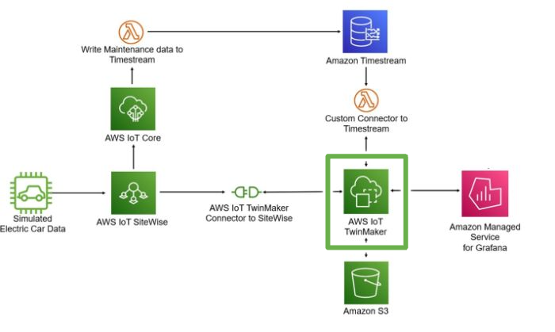

# README Template

## Table of Contents

- [About](#about)
  - [Technology Stack](#technology-stack)
  - [Application Architecture Diagram (Optional)](#application-architecture-diagram-optional)
- [Getting Started](#getting-started)
  - [Prerequisites](#prerequisites)
  - [Installation](#installation)
  - [Running](#running)
  - [Usage](#usage)
- [Development](#development)

## About

Describe the purpose of the project here.

Things to include:

- What business problem does the project solve
- What does the project do
- Link to the work board concerning the project

### Technology Stack

List the technologies used to build project. Consider adding links to official documentation for each technology.

### Application Architecture Diagram (Optional)

Architecture diagrams helps improve communication of how the application is structured and gives context into how it works in conjunction with other components of a system.

It can include elements like:

- Application interactions with immediately related components
- Data flow between application and immediately related components
- Annotations that help convey critical information
- Images that help illustrate components

For example, if the application in your repository is about IoT TwinMaker, it can be diagrammed as such:

## Getting Started

Give instructions for setup and running the project locally. It's important to be as clear as possible because you may have underlying assumptions about other people's knowledge and/or you have certain environmental tools already set up that you don't think of when writing the instructions. We avoid a lot of questions when we are explicit about how to setup a project and what different parts of setup do.

For example, when writing instructions to run a specific docker command, don't assume that someone's environment has the tool already. Give a shell command that will install it or link official documentation. Then explain what the specific docker command does and how it relates to the application.

### Prerequisites

List the local machine dependencies that are needed as a foundation for the project.

Examples include:

- Programming language(s)
- Docker
- Environment variables
- etc.

### Installation

List the steps to install the project locally.

### Running

List the steps to run the project locally.

### Usage

List the information about how the project can be used locally.

Things to consider:

- Screenshots
- Code snippets
- Shell commands
- Reference to internal file
- Reference to external documentation

## Development

Consider having subheaders to cover important topics concerning development on the project.

Examples include documenting:

- Generating Swagger for API endpoints
- Standardized development tasks
- Installing pre-commit hooks
- Installing new dependencies
- etc.
